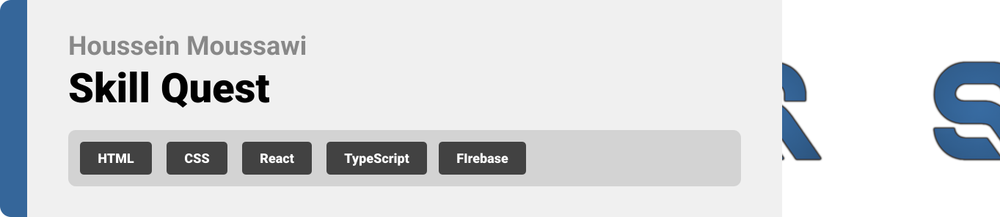
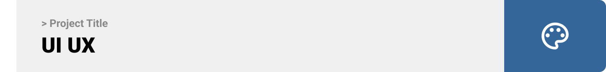
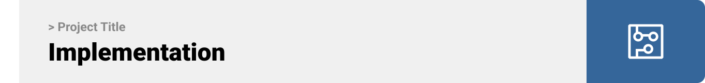
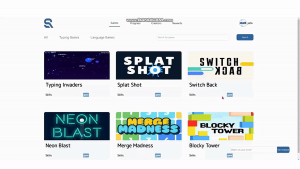

<br><br>

<!-- project philosophy -->


A website where users learn new skills through playing fun games and completing challenges. 

SkillQuest is revolutionizing the way individuals acquire new skills by gamifying the learning experience. Our website offers a dynamic platform where users can engage in interactive games and challenges designed to enhance their knowledge and abilities.

SkillQuest provides a fun and immersive environment to achieve your learning goals. We believe in making learning enjoyable and accessible, empowering our users to unlock their full potential while having a great time along the way.

### User Stories
- As a user, I want to explore the available skills categories, so I can find areas of interest that align with my learning goals.
- As a user, I want to play games, so I can have fun while learning new skills.
- As a user, I want to receive notifications for new challenges, so I can continuously expand my knowledge with new levels.

<br><br>
<!-- Tech stack -->


###  Skill Quest is built using the following technologies:

- This project uses the [React single page app development framework](https://react.dev/). React is a free and open-source front-end JavaScript library for building user interfaces based on components.
- For persistent storage (database), the app uses the [MongoDB](https://www.mongodb.com/) MongoDB is a source-available, cross-platform, document-oriented database program. Classified as a NoSQL database product.
- To send local push notifications, the app uses the [FireBase Messaging](https://firebase.google.com/) which is a cross-platform cloud service for messages and notifications for Android, iOS, and web applications.
- For the backend the app uses [Nodejs](https://nodejs.org/en) which is a cross-platform, open-source JavaScript runtime environment that can run on Windows, Linux, Unix, macOS, and more, with [Mongoose] which is a Node.js-specific MongoDB Object-Document Mapping (ODM) library.
-the Project also uses [Phaser game development framework](https://phaser.io/)which is a 2D game framework used for making HTML5 games for desktop and mobile.

<br><br>
<!-- UI UX -->



> We designed Skill Quest using wireframes and mockups, iterating on the design until we reached the ideal layout for easy navigation and a seamless user experience.

- Project Figma design [figma](https://www.figma.com/design/6DbHfBMAAVcMzNNbfYUO0s/Skill-Quest?node-id=0-1&t=w6fLH9MCO9gYk4Vi-0)


### Mockups
| Progress screen  | Games Screen | Profile Screen |
| ---| ---| ---|
|  |  |  |

<br><br>

<!-- Database Design -->


###  Architecting Data Excellence: Innovative Database Design Strategies:

 


<br><br>


<!-- Implementation -->



### User Screens 
| Login screen  | Games screen | Game screen | Progress screen |
| ---| ---| ---| ---|
|  |  |  |  |
| Gameplay screen   | AI Screen | Rewards Screen |
|   |  |  |


<br><br>


<!-- Prompt Engineering -->


###  Perfecting AI Interaction: Revealing the Potential of Prompt Crafting:

- This project employs sophisticated prompt engineering methodologies to enhance interactions with natural language processing models. Through adept crafting of input instructions, we customize the models' behavior to achieve accurate and effective language comprehension and generation, catering to diverse tasks and preferences.

<br><br>

<!-- AWS Deployment -->


###  Optimized Deployment: Harnessing the Power of AWS Integration:

- This project utilizes AWS deployment strategies to integrate and deploy natural language processing models effortlessly. Emphasizing scalability, reliability, and performance, we ensure that AI applications driven by these models provide robust and responsive solutions for various use cases.

### How reverse proxy was configured:

- #### Fetch the cloudflared package by downloading it from the latest release:
```bash
wget https://github.com/cloudflare/cloudflared/releases/latest/download/cloudflared-linux-amd64.deb
```

- #### Proceed to install the package:
```bash
sudo dpkg -i cloudflared-linux-amd64.deb
```

- #### Authenticate cloudflared using your logged-in Cloudflare account associated with your domain:
```bash
cloudflared login
```

- #### Create a tunnel with a specified name:
```bash
cloudflared tunnel create skillquest
```

- #### Copy the ID of the tunnel from the output.

- #### Navigate to the cloudflared configuration directory:
```bash
cd ~/.cloudflared
```

- #### Configure a CNAME DNS record on the Cloudflare website, pointing it to your tunnel ID.

- #### Open the configuration file for editing:
```bash
nano config.yml
```

- #### Inside the editor, input the tunnel ID and specify the path to the credentials file:
```yaml
tunnel: tunnel-id-copied
credentials-file: /home/ubuntu/.cloudflared/tunnel-id-copied.json

ingress:
  - hostname: https://skillquest.book-hub.org/
    service: http://localhost:3001
  - service: http_status:404
```

- #### Start the cloudflared tunnel:
```bash
cloudflared tunnel run skillquest
```

- #### Install and configure the cloudflared service:
```bash
sudo nano /etc/systemd/system/cloudflared.service
```

- #### Within the editor, add the following service configuration:
```ini
[Unit]
Description=Cloudflare reverse proxy
After=network.target

[Service]
TimeoutStartSec=0
Type=notify
ExecStart=/usr/local/bin/cloudflared tunnel run skillquest
Restart=always
User=ubuntu

[Install]
WantedBy=multi-user.target
```

- #### Reload systemd services:
```bash
sudo systemctl daemon-reload
```

- #### Start the cloudflared service:
```bash
sudo systemctl start cloudflared
```

- #### Enable automatic service restart on boot:
```bash
sudo systemctl enable cloudflared
```

<br><br>

<!-- Unit Testing -->


###  Precision in Development: Harnessing the Power of Unit Testing:

- This project employs rigorous unit testing methodologies to ensure the reliability and accuracy of code components. By systematically evaluating individual units of the software, we guarantee a robust foundation, identifying and addressing potential issues early in the development process.


<br><br>


<!-- How to run -->


> To set up Coffee Express locally, follow these steps:

### Prerequisites

This is an example of how to list things you need to use the software and how to install them.
* npm
  ```sh
  npm install npm@latest -g
  ```

### Installation

_Below is an example of how you can instruct your audience on installing and setting up your app. This template doesn't rely on any external dependencies or services._


1. Clone the repo
   git clone [github](https://github.com/HousseinMoussawi/Skill-Quest.git)
2. Install NPM packages
   ```sh
   npm install
   ```
3. In the backend folder create a file   and call it:
   ```js 
   .env
   ```
4. Add the following code to the .env file:
   ```js
   MONGODB_URI="mongodb://localhost:27017/Skill_Quest_db"

   PORT=3001

   SECRET_KEY=MY_SECRET_KEY

   OPENAI_API_KEY=sk-proj-xsubwmvi8OI9OMOc0X0DT3BlbkFJLuajODlwe8qXGgn0dwON
   ```
Now, you should be able to run Skill Quest locally and explore its features.